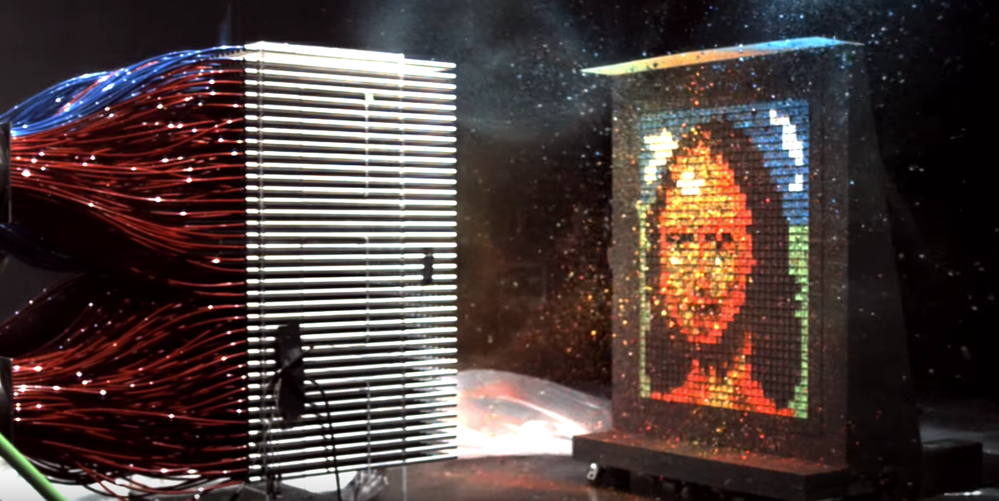

<p style="line-height:1.4;font-size:3em">[2016-7-24<br>HTML5感](http://html5exam.jp/newsdetail/seminar20160724/)</p>

<p style="line-height:1.4;font-size:2em">[html5exam.jp](http://html5exam.jp/)</p>

----

<h1 style="line-height:1.4;font-size:2em">HTML5でこんなことが<br>できるというのを<br>ひたすら紹介する50分</h1>

<p style="margin-bottom:0;padding-bottom:0">高津戸壮 <a href="https://twitter.com/Takazudo">@Takazudo</a></p>

----

## 自己紹介

<div style="display:table; width: 100%">
<div style="display:table-cell; vertical-align:middle; width:65%; vertical-align:top; padding:30px 0 0">
<ul>
<li>高津戸壮 (たかつど たけし)</li>
<li><a href="http://www.pxgrid.com/">株式会社ピクセルグリッド</a></li>
<li>フロントエンドエンジニア</li>
<li><a href="twitter.com/Takazudo">@Takazudo</a></li>
</ul>
</div>
<div style="display:table-cell; vertical-align:middle; width:35%"></div>
</div>

---


----

## 今日話すこと

* こういうのをやりました
* HTML5ってこんなことができる
* HTML5との付き合い方

----

# こういうのを<br>やりました

----

## いつも可愛い

http://www.itsumokawaii.jp/

---

* IE10で使えるようになった新技術を使う
* canvas
* audio
* video

---


---


---


---


---


---


---


----

## 東京Node学園祭2015

http://nodefest.jp/2015/

---

* なんか新しい技術使おう的なノリ
* 毎年何か大体WebSockets使ってる
* Web Components (Polymer)
* SVG

---


---


----

## HTML5って<br>こんなことができる

----

## 今日紹介する<br>HTML5のこと

* 文章構造まわりの新要素
* フォームまわりの新要素／属性
* audio、video要素
* Web Audio API
* canvas要素
* WebGL

---

<div class="x-Div2">
  <div>
    <ul>
      <li>SVG</li>
      <li>CSS</li>
      <li>WebSockets</li>
      <li>WebRTC</li>
      <li>Web Storage API</li>
    </ul>
  </div>
  <div>
    <ul>
      <li>History API</li>
      <li>Drag and drop</li>
      <li>Fullscreen API</li>
      <li>Geolocations API</li>
    </ul>
  </div>
</div>

----

## 文章構造まわりの新要素

<div class="x-Div2 x-Div2-lrshrinked">
  <div>
    <ul>
      <li>header</li>
      <li>footer</li>
      <li>section</li>
      <li>article</li>
    </ul>
  </div>
  <div>
    <ul>
      <li>nav</li>
      <li>main</li>
      <li>aside</li>
      <li>details</li>
    </ul>
  </div>
</div>

など

---

```html
<header>
  <h1>HTML5が最高な点について</h1>
</header>

<article>
  <header>
    <h1>今日の日記</h1>
  </header>
  <p>本日は晴天でした</p>
</article>
```

---

### 何が嬉しいのか

* その前に
* WAI-ARIA
* Web Accessibility Initiative (WAI)
* Accessible Rich Internet<br>Applications (ARIA)
* Webアプリケーションをもっと<br>アクセシブルにできる仕様

---

### WAI-ARIAを設定した例

必須であることを示す 「必須 テキストを編集」

```html
<input type="text" aria-required="true">
```

変化があったら伝える 「21」「22」…

```html
<span class="counter" aria-live="polite">20</span>
```

---

### role属性


---


---

### HTML5で書くと


----

## フォームまわりの<br>新要素／属性

* 今までJSで頑張ってたことがちょろっとできる
* レンジ
* 日付ピッカー
* 色ピッカー
* バリデーション
* オートコンプリート

---


---


---


---


```html
<input type="url">
<input type="email">
```

```css
input:invalid { background-color: #ffdddd; }
input:valid { background-color: #ddffdd; }
```

---

```html
<input name="city" list="cities" />
<datalist id="cities">
  <option value="Naples" />
  <option value="London" />
  <option value="Berlin" />
  <option value="New York" />
  <option value="Frattamaggiore" />
</datalist>
```

---


----

## audio, video

* 音ならせる
* ビデオ再生できる
* 昔はFlashとかSilverlightとか
* preloadしたりloopしたり

---


```html
<audio src="sound.mp3" controls></audio>
```

---


```html
<video src="movie.mp4" controls width="480" height="360"></video>
```

---

### Media events

* play: 再生された
* pause: 一時停止された
* canplaythrough	: このDL速度なら再生してもいいぜ
* progress: 読み込みすすんでます
* seeked: シークされた

---


[Nike](http://www.nike.com/jp/ja_jp/c/sustainability)

---


[ライフ・オブ・パイ](http://www.lifeofpimovie.com/)

---


[KLM iFly 50](https://www.ifly50.com/en_jp/50)

---


[いつも可愛い](http://www.itsumokawaii.jp/)

----

## Web Audio API

* 音を作れる
* 音を操作できる
* 2つ以上の音を混ぜる
* フィルタをかける

---


http://labs.fluuu.id/lines/

---


[Beatport](https://www.beatport.com/)

---


[Plink](http://labs.dinahmoe.com/plink/)

---


[HELIOS | YUME](http://unseen-music.com/yume/)

----

## canvas

* JavaScriptで画像を作れる
* 線を引いたり
* 画像を読みこんだり

---


```html
<canvas id="canvas"></canvas>
```

```js
var canvas = document.getElementById('canvas');
var ctx = canvas.getContext('2d');
ctx.beginPath();
ctx.moveTo(75,50);
ctx.lineTo(100,75);
ctx.lineTo(100,25);
ctx.fill();
```

---


```html


```

---


```js
var canvas = document.getElementById('canvas');
var ctx = canvas.getContext('2d');
var rhino = document.getElementById('source');
var frame = document.getElementById('frame');
ctx.drawImage(rhino, 33, 71, 104, 124, 21, 20, 87, 104);
ctx.drawImage(frame ,0,0);
```

---


[videoとの組み合わせ](http://www.craftymind.com/factory/html5video/CanvasVideo.html)

---


[株式会社コンテンツ](http://www.contents.ne.jp/)

---


[メンズシェーバー ラムダッシュ](http://panasonic.jp/shaver/lamdash/dna/index.html)

---

### ライブラリに任せたい機能

* レイヤー的な機能
* スプライトイメージ
* マウス＆タッチイベント
* アニメーション

---


[CreateJS](http://www.createjs.com/)

---


[Paper.js](http://paperjs.org/)

----

## WebGL

* GPUを使った処理が可能
* グラフィックスの処理
* 最終的にはcanvasに描画される

---


---


[What is GPU Computing?](http://www.nvidia.com/object/what-is-gpu-computing.html)


---


[Mythbusters Demo GPU versus CPU](https://www.youtube.com/watch?v=-P28LKWTzrI)

---


---


---



---


[Three.js](http://threejs.org/)

---


[Pixi.js](http://www.pixijs.com/)

---


http://newyear.delaneau.com/

---


[3 dreams of black](http://www.ro.me/)

---


[Sennheiser Reshaping Excellence](http://www.sennheiser-reshapingexcellence.com/en)

---


[Technical Creator Hub](https://www.cyberagent.co.jp/technicalcreator/)

----

## SVG

* ベクターグラフィックスのフォーマット
* スケーラブル
* XMLベース
* DOMで操作可能

---

```xml
<svg
  xmlns="http://www.w3.org/2000/svg"
  width="512"
  height="512"
  viewBox="0 0 512 512"
  >
    <circle
      cx="150"
      cy="200"
      r="100"
      fill="#06f"
    ></circle>
</svg>
```

---


---

```html

```

```css
.box{
  background-image: url(circle.svg);
}
```

```html
<div>
  <svg width="320" height="320">
    <circle cx="100" cy="100" r="100" fill="red">
  </svg>
</div>
```

---


[NHN Play Art](http://www.nhn-playart.com/)

---


[Type Terms](https://www.supremo.tv/typeterms/)

---


[Waaark](http://waaark.com/)

---


[株式会社ピクセルグリッド地図](https://www.pxgrid.com/access/)

----

## CSS

* Transform 2D / 3D
* Transition
* Animation
* Flexbox
* Grid layout

---


[CSS3 transform Generator](http://www.css3-generator.de/transform.html)

---


[Animate.css](http://daneden.github.io/animate.css/)

---


[Flexplorer](http://bennettfeely.com/flexplorer/)


---


---


[3d animation using pure CSS3](http://demo.marcofolio.net/3d_animation_css3/)

---


[Original Hover Effects with CSS3](http://tympanus.net/Tutorials/OriginalHoverEffects/index.html)

---


[three.js - periodic table](http://threejs.org/examples/css3d_periodictable.html)

---


[stroll.js](http://lab.hakim.se/scroll-effects/)

----

## WebSockets

* 双方向通信
* 昔はlong polling
* サーバーを介す

---


[GitHub](https://github.com/)

---


[slack](https://slack.com/)

---


[Node学園祭 2015](http://nodefest.jp/2015/)

---


[socket.io](http://socket.io/)

----

## Web RTC

* Web Real Time Communication
* P2P

---


[ビデオチャットもさくっと作れる！ WebRTCによるブラウザ間リアルタイム通信はじめの一歩](https://codezine.jp/article/detail/8099)


---


[SkyWay](http://nttcom.github.io/skyway/index.html)

---


[MistCDN](https://www.mist-t.co.jp/mistcdn)

----

## Web Storage API

* localStorage
* sessionStorage
* key-value型
* 昔はcookie

---


---


---

`__typeahead__:recentSearchesList`

```json
[
  {
    "normalized_name": "pokemon go",
    "name": "pokemon GO",
    "recent_search_path": "/search?src=typd&q=pokemon%20GO",
    "search_query_source": "typed_query",
    "origin": "prefetched"
  },
  {
    "normalized_name": "html5感",
    "name": "HTML5感",
    "recent_search_path": "/search?src=typd&q=HTML5%E6%84%9F",
    "search_query_source": "typed_query",
    "origin": "prefetched"
  }
]
```

----

## History API

* window.history.pushState
* popstate

---


---


---


[jQuery.LazyJaxDavis](http://takazudo.github.io/jQuery.LazyJaxDavis/doc/)

----

## Drag and Drop

* 要素をつまんだ時の挙動を制御可能
* ドラッグされてくる情報を取得

---


[ネイティブ HTML5 ドラッグ＆ドロップ<br>HTML5 Rocks](http://www.html5rocks.com/ja/tutorials/dnd/basics/)


---


Google Photos

----

## Fullscreen API

* フルスクリーンにできる

---


[Instant caribbean vacation](http://awaywego.carnival.com/360vacation/)

----

## Geolocations API

* ユーザーの位置情報を取得できる

---


[Google Maps](https://www.google.com/maps)

----

# HTML5との<br>付き合い方

----


[Modernizr](https://modernizr.com/)

----

### Polyfill


[MediaElement.js](http://mediaelementjs.com/)

----

* バグ
* パフォーマンス
* 仕様変更の可能性
* 対応状況

----


[Can I use...](http://caniuse.com/)

----


[CodeGrid](http://www.codegrid.net/)

----

# ありがとう<br>ございました
